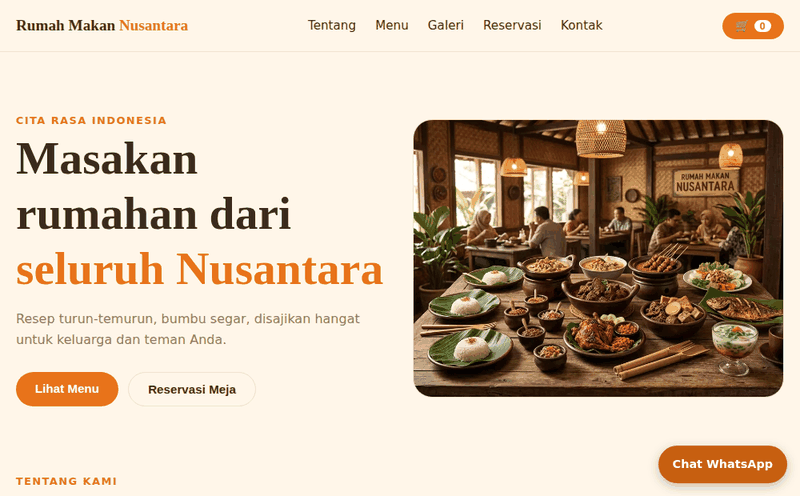

<div align="center">


### Website rumah makan dengan menu digital, keranjang pesanan, dan reservasi via WhatsApp


**[🍛 Buka Website](https://USERNAME.github.io/rumah-makan-nusantara/)** &nbsp;·&nbsp; **[📷 Instagram](https://www.instagram.com/rmnu.santara)**

<br>



</div>

---

## ✨ Fitur

| | Fitur | Keterangan |
|---|---|---|
| 🍽️ | **Menu digital** | 14 menu berfoto, filter kategori, pencarian, dan label (Terlaris, Pedas, Baru, dll.) |
| 🛒 | **Keranjang pesanan** | Tambah/kurang porsi, total otomatis, tersimpan di browser |
| 💬 | **Pesan via WhatsApp** | Pesanan tersusun rapi dan langsung terkirim ke WhatsApp rumah makan |
| 📅 | **Reservasi meja** | Form dengan validasi tanggal dan nomor, konfirmasi via WhatsApp |
| 🖼️ | **Galeri foto** | Klik foto untuk memperbesar |
| 📍 | **Peta & kontak** | Google Maps, alamat, jam buka, dan tombol WhatsApp mengambang |
| 🌗 | **Mode terang/gelap** | Mengikuti pengaturan perangkat |
| 📱 | **Responsif** | Nyaman di ponsel maupun komputer |

## 🗂️ Struktur

```
rumah-makan-nusantara/
├── index.html      halaman utama
├── style.css       tampilan
├── script.js       menu, keranjang, reservasi, pengaturan (CONFIG)
├── favicon.svg     ikon tab browser
├── assets/         gambar untuk README
└── images/         foto menu dan foto utama (.webp)
```

## 🚀 Cara online lewat GitHub Pages

<details>
<summary><b>Klik untuk melihat langkah-langkahnya</b></summary>

1. Buat repositori **Public** bernama `rumah-makan-nusantara`.
2. Klik **Add file > Upload files**, seret isi folder proyek (bukan ZIP-nya), lalu **Commit changes**.
3. Buka **Settings > Pages**, pilih **Branch: `main`** dan **`/ (root)`**, lalu **Save**.
4. Tunggu 1-2 menit. Situs tampil di `https://USERNAME.github.io/rumah-makan-nusantara/`.

Setelah itu, ganti `USERNAME` di README ini dengan nama akun GitHub Anda.

</details>

## 🛠️ Cara mengubah isi

<details>
<summary><b>Klik untuk melihat panduan</b></summary>

Semua pengaturan ada di `script.js`.

| Yang ingin diubah | Di mana |
|---|---|
| Nomor WhatsApp (format `62...`), Instagram, TikTok, Facebook, lokasi peta | Bagian `CONFIG` di paling atas |
| Nama, deskripsi, harga menu | Daftar `MENU` (`n`, `d`, `p`) |
| Label menu | `t:["Terlaris","Pedas"]` pada menu terkait |
| Menu habis | Tambahkan `s:1` pada menu terkait |
| Ulasan pelanggan | Daftar `TESTIMONIALS` (kosong = bagian ulasan tersembunyi) |
| Foto menu | Ganti file di folder `images/` dengan nama yang sama |
| Alamat, jam buka, telepon | `index.html`, bagian Kontak |

Setiap perubahan: edit file di GitHub lalu **Commit changes**. Situs ikut diperbarui dalam 1-2 menit.

</details>

## 📝 Catatan

- Pesanan dan reservasi dikirim lewat WhatsApp dan tidak tersimpan otomatis.
- Situs ini statis, jadi tidak perlu server dan tidak ada biaya hosting.

---

<div align="center">

Dibuat untuk **Rumah Makan Nusantara** · Jl. Raya Binong No. 30

</div>
